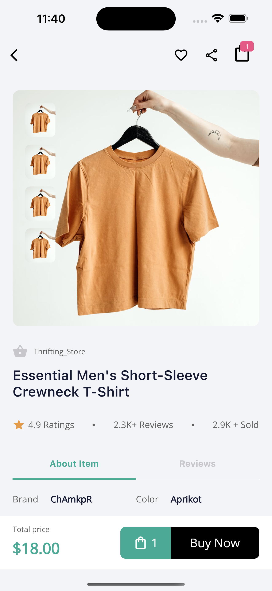

# market_place_assignment

An e-commerce POC.

This Market Place app is built with Flutter.

## Screenshots

### Home Screen

&nbsp;&nbsp;&nbsp;&nbsp;&nbsp;&nbsp;&nbsp;&nbsp;

### Product Details Screen



## ✨ Requirements

- Any Operating System (ie. MacOS X, Linux, Windows)
- Any IDE with Flutter SDK installed (ie. Android Studio, VSCode, IntelliJ, etc)
- A little knowledge of Dart and Flutter

## Run Locally

```bash
  git clone https://github.com/lexican/market_place_assignment.git
  cd market_place_assignment
  flutter pub get
  flutter run
```
